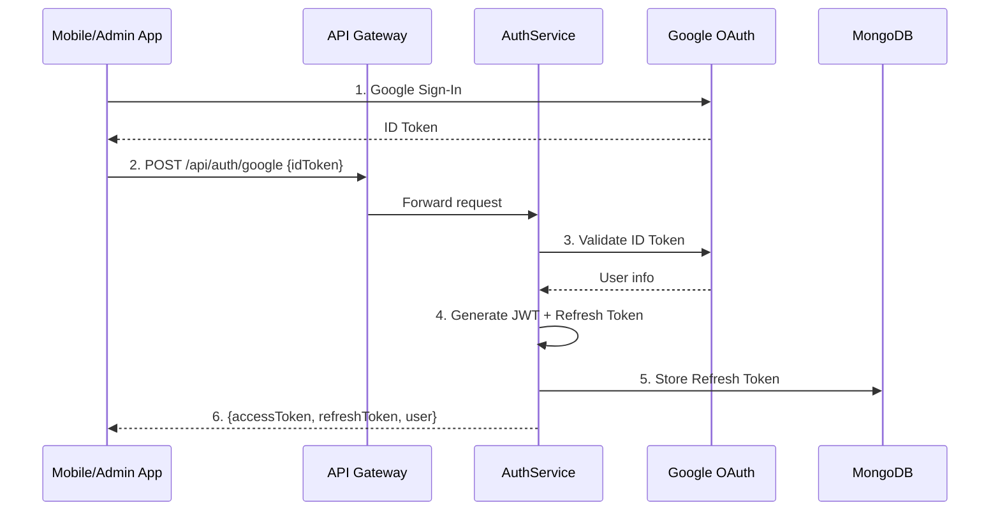

# AuthService

## Overview

Dịch vụ xác thực cho Mã Siu platform. **CHỈ hỗ trợ Google Sign-In** - không có email/password.

## Architecture

**Lightweight Clean Architecture** (không full DDD):
- `AuthService.Api` - Controllers, Program.cs
- `AuthService.Application` - Business logic, DTOs, interfaces
- `AuthService.Domain` - Entities (RefreshToken)
- `AuthService.Infrastructure` - Google OAuth, JWT, MongoDB

## Endpoints

| Method | Path | Description | Auth |
|--------|------|-------------|------|
| POST | `/api/auth/google` | Sign in with Google ID token | ❌ |
| POST | `/api/auth/refresh` | Refresh access token | ❌ |
| POST | `/api/auth/revoke` | Revoke refresh token (logout) | ❌ |
| GET | `/api/auth/health` | Health check | ❌ |

## Authentication Flow



## Token Rotation

Khi refresh token:
1. Old refresh token bị revoke
2. New refresh token được tạo với ID của old token (chain)
3. Nếu phát hiện reuse token đã revoke → revoke toàn bộ chain (fraud detection)

## Configuration

```json
{
  "Jwt": {
    "Secret": "MIN_32_CHARACTERS_SECRET_KEY",
    "Issuer": "gateway-sale.nhatcuong.io.vn",
    "Audience": "masiu-app",
    "AccessTokenExpirationMinutes": 15,
    "RefreshTokenExpirationDays": 7
  },
  "Google": {
    "ClientId": "YOUR_CLIENT_ID.apps.googleusercontent.com"
  }
}
```

## Running

```bash
cd src/Services/AuthService/AuthService.Api
dotnet run
# Service starts at http://localhost:5101
```
